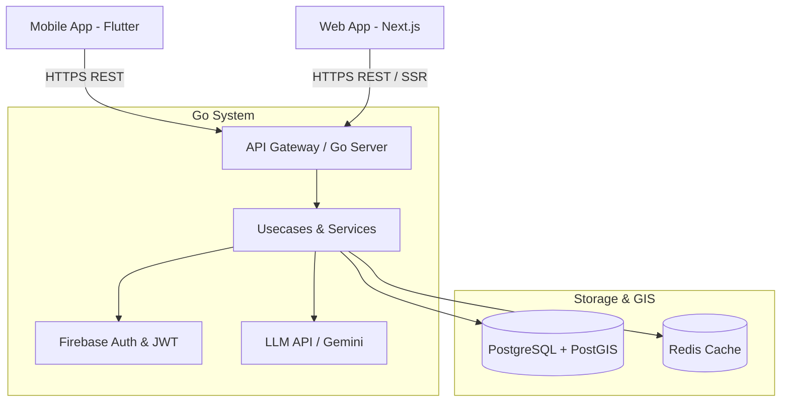
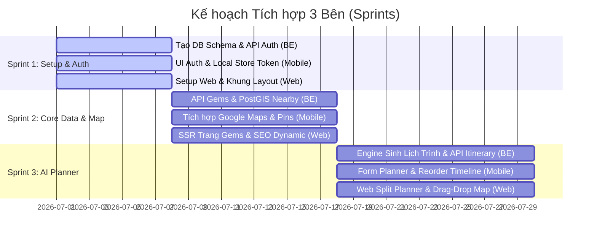

# 📋 Bảng Phân Chia Công Việc & Nhiệm Vụ (Task Assignment)
## Dự án: TripWise — Giai đoạn MVP & Social (P1 & P2)

Tài liệu này phân rã và phân chia công việc chi tiết cho đội ngũ phát triển gồm **3 thành viên**:
1. **Developer 1: Backend Engineer (Go)** — Phụ trách phát triển API, cơ sở dữ liệu địa lý (PostGIS) và hạ tầng.
2. **Developer 2: Frontend Mobile Engineer (Flutter)** — Phát triển ứng dụng di động đa nền tảng phục vụ luồng trải nghiệm chính của người dùng.
3. **Developer 3: Frontend Web Engineer (Next.js)** — Phát triển website tối ưu SEO (Discovery), ứng dụng lập kế hoạch màn hình rộng (Planner Web) và trang quản trị (Admin Dashboard).

---

## 🛠️ Bản đồ Phân vai & Công nghệ (Tech Stack Mapping)

---

## 💻 DEVELOPER 1: BACKEND ENGINEER (GO)

**Vai trò chính:** Thiết kế CSDL, phát triển API, tích hợp dịch vụ bên thứ ba (Firebase Auth, Bản đồ, Gemini LLM), tối ưu hóa câu truy vấn không gian (Geospatial queries) bằng PostGIS.

### 📌 Task 1.1: Thiết kế & Mở rộng Schema Cơ sở dữ liệu (PostgreSQL + PostGIS)
*   **Mục tiêu:** Mở rộng DB hiện tại để lưu trữ Địa điểm (Gems), Lịch trình (Itineraries), Bộ sưu tập (Collections) và các tương tác mạng xã hội.
*   **Chi tiết công việc:**
    1.  Tạo migration script `migrations/002_add_core_tables.sql`.
    2.  Định nghĩa bảng `gems`: thêm cột tọa độ không gian địa lý `geom GEOMETRY(Point, 4326)`.
    3.  Định nghĩa bảng `gem_images`, `gem_reviews`, `categories`.
    4.  Thiết kế bảng lịch trình:
        *   `itineraries` (user_id, title, destination, start_date, end_date, budget, preferences).
        *   `itinerary_days` (itinerary_id, day_number).
        *   `itinerary_activities` (day_id, gem_id, start_time, end_time, cost, notes, sequence_order).
    5.  Thiết kế bảng bộ sưu tập: `collections`, `collection_items`.
    6.  Bảng tương tác xã hội: `follows`, `likes` (cho gems/itineraries).
*   **Kết quả bàn giao (Deliverables):**
    *   File migration SQL đầy đủ.
    *   Đăng ký các Entities tương ứng trong Go (sử dụng GORM/SQLx).

### 📌 Task 1.2: Xây dựng Bộ API Địa điểm & Truy vấn Địa lý (Gems & PostGIS APIs)
*   **Mục tiêu:** Cho phép tìm kiếm, lọc địa điểm du lịch xung quanh vị trí của người dùng.
*   **Chi tiết công việc:**
    1.  `GET /api/v1/gems` - Lấy danh sách địa điểm (hỗ trợ lọc theo chuyên mục: ẩm thực, thiên nhiên, cà phê...).
    2.  `GET /api/v1/gems/nearby` - Tìm địa điểm xung quanh vị trí GPS hiện tại (sử dụng hàm `ST_DWithin` hoặc `ST_Distance` của PostGIS để tối ưu hiệu năng).
    3.  `GET /api/v1/gems/:id` - Xem chi tiết địa điểm (kèm danh sách ảnh, đánh giá trung bình).
    4.  `POST /api/v1/gems/:id/reviews` - Đăng review & rating.
*   **Kết quả bàn giao (Deliverables):**
    *   Bộ route và handler hoàn thiện cho Gems.
    *   Tài liệu Swagger/Postman API cập nhật.

### 📌 Task 1.3: Phát triển Engine Sinh Lịch Trình Tự Động (AI Travel Generator)
*   **Mục tiêu:** Core Engine sinh các phương án lịch trình di chuyển tối ưu dựa trên sở thích và số ngày đi.
*   **Chi tiết công việc:**
    1.  Tích hợp API LLM (Gemini API / OpenAI API) để phân tích sở thích của người dùng và đề xuất danh sách địa điểm phù hợp.
    2.  Áp dụng giải thuật routing (hoặc tích hợp OSRM / Google Directions API) để sắp xếp thứ tự di chuyển giữa các điểm trong ngày sao cho ngắn nhất.
    3.  `POST /api/v1/itineraries/generate` - Nhận tham số đầu vào (tỉnh/thành, ngân sách, số ngày, sở thích, nhịp độ) -> Sinh ra 3 phương án lịch trình gợi ý.
    4.  `POST /api/v1/itineraries` - Lưu lịch trình người dùng chọn.
    5.  `PUT /api/v1/itineraries/:id` - Cho phép cập nhật/chỉnh sửa hoạt động (sắp xếp lại thứ tự, đổi giờ).
*   **Kết quả bàn giao (Deliverables):**
    *   Service sinh lịch trình AI kết hợp giải thuật tối ưu khoảng cách.
    *   Hệ thống API CRUD cho Itineraries.

### 📌 Task 1.4: Xây dựng Hệ thống Bộ sưu tập & Tương tác Xã hội
*   **Mục tiêu:** Cung cấp API để người dùng lưu trữ, chia sẻ và tương tác.
*   **Chi tiết công việc:**
    1.  API CRUD cho Bộ sưu tập (`collections`).
    2.  API thêm/bớt địa điểm hoặc lịch trình vào bộ sưu tập (`collection_items`).
    3.  API Like & Follow: `POST /api/v1/gems/:id/like`, `POST /api/v1/users/:id/follow`.
    4.  `GET /api/v1/feed` - Bảng tin hoạt động của những người dùng đang follow (hiển thị hành trình mới của họ, các địa điểm họ vừa review).
*   **Kết quả bàn giao (Deliverables):**
    *   API Collections & Social.

---

## 📱 DEVELOPER 2: FRONTEND MOBILE ENGINEER (FLUTTER)

**Vai trò chính:** Xây dựng ứng dụng di động Flutter (Android & iOS), tích hợp Google Maps SDK, quản lý trạng thái bằng BLoC, xử lý GPS thời gian thực.

### 📌 Task 2.1: Đồng bộ luồng Auth & Profile (Firebase + JWT)
*   **Mục tiêu:** Tích hợp giao diện đăng nhập và quản lý token.
*   **Chi tiết công việc:**
    1.  Thiết kế UI Đăng nhập/Đăng ký chuẩn Material Design 3.
    2.  Tích hợp SDK Firebase Auth (Google Login, Apple Login).
    3.  Sử dụng `flutter_secure_storage` để lưu trữ JWT (Access Token & Refresh Token) an toàn.
    4.  Xây dựng AuthBLoC quản lý trạng thái phiên đăng nhập của người dùng.
*   **Kết quả bàn giao (Deliverables):**
    *   Màn hình Auth & Hồ sơ cá nhân.
    *   Interceptor trong thư viện Dio tự động đính kèm Token và xử lý Refresh Token khi hết hạn.

### 📌 Task 2.2: Bản đồ Khám phá & Gợi ý Địa điểm (Interactive Maps & Discovery)
*   **Mục tiêu:** Cho phép người dùng duyệt địa điểm trên bản đồ một cách trực quan.
*   **Chi tiết công việc:**
    1.  Tích hợp `google_maps_flutter` và cấu hình API Key trên Android/iOS.
    2.  Xử lý xin quyền định vị người dùng (`geolocator`).
    3.  Hiển thị các địa điểm du lịch (Gems) dưới dạng Pins trên bản đồ.
    4.  Áp dụng **Marker Clustering** để tránh rối mắt khi có quá nhiều điểm trong một khu vực.
    5.  Thiết kế thanh ngang lọc thể loại phía trên bản đồ, và Card Preview (vuốt ngang) hiển thị tóm tắt địa điểm ở phía dưới màn hình khi chạm vào Pin.
*   **Kết quả bàn giao (Deliverables):**
    *   Màn hình Bản đồ khám phá tương tác mượt mà.

### 📌 Task 2.3: Trang Chi Tiết Địa Điểm & Đánh giá (Gem Profile & Review UI)
*   **Mục tiêu:** Hiển thị thông tin trực quan, review của cộng đồng và nút tương tác.
*   **Chi tiết công việc:**
    1.  Xây dựng màn hình chi tiết địa điểm: Ảnh banner trượt, thông tin mô tả, giờ mở cửa, chi phí trung bình.
    2.  Tích hợp nút "Thêm vào Bộ sưu tập" và "Thêm vào Wishlist".
    3.  Trình bày danh sách Reviews (phân trang).
    4.  UI "Đăng đánh giá": Cho phép chọn số sao (1-5), nhập cảm nghĩ và đính kèm hình ảnh.
*   **Kết quả bàn giao (Deliverables):**
    *   Màn hình chi tiết Gems & luồng viết Review hoàn chỉnh.

### 📌 Task 2.4: Giao diện Lập Lịch Trình Thông Minh (Itinerary Planner UI)
*   **Mục tiêu:** Luồng giao diện giúp nhập thông tin đầu vào cho AI và xem/chỉnh sửa lịch trình.
*   **Chi tiết công việc:**
    1.  Thiết kế form lập kế hoạch nhiều bước (Multi-step form): Chọn điểm đến -> Chọn ngày khởi hành -> Chọn ngân sách -> Chọn sở thích -> Chọn tốc độ di chuyển.
    2.  Hiển thị màn hình Loading sinh động trong lúc chờ API Backend xử lý.
    3.  Hiển thị kết quả: Cho phép so sánh 3 phương án lịch trình (tab-view).
    4.  Màn hình chi tiết lịch trình:
        *   Hiển thị timeline theo từng ngày đi (Day 1, Day 2...).
        *   Tích hợp bản đồ mini chỉ đường giữa các điểm trong ngày.
        *   Hỗ trợ kéo thả (`ReorderableListView`) để người dùng tự do sắp xếp lại thứ tự ghé thăm các địa điểm.
*   **Kết quả bàn giao (Deliverables):**
    *   Luồng tạo và biên tập lịch trình tối ưu trên di động.

---

## 🌐 DEVELOPER 3: FRONTEND WEB ENGINEER (NEXT.JS)

**Vai trò chính:** Thiết lập source web Next.js mới, tối ưu hóa SEO để thu hút traffic tự nhiên từ Google (địa điểm, lịch trình chia sẻ), xây dựng Planner màn hình rộng và Admin Dashboard.

### 📌 Task 3.1: Khởi tạo Project & Thiết lập Design System (Tailwind + TS)
*   **Mục tiêu:** Setup nền tảng source web mới có hiệu năng cao và đồng bộ giao diện.
*   **Chi tiết công việc:**
    1.  Cấu hình Next.js App Router, TypeScript, ESLint.
    2.  Tích hợp Tailwind CSS, cấu hình biến màu HSL theo phong cách tối giản, sang trọng (Sử dụng CSS Variables).
    3.  Tạo các component dùng chung (Button, Card, Input, Modal, Dropdown, Skeleton loader).
    4.  Tích hợp `next-themes` hỗ trợ Light/Dark mode.
*   **Kết quả bàn giao (Deliverables):**
    *   Khung source code web (`web-app`) hoàn chỉnh, clean architecture.

### 📌 Task 3.2: Phát triển Trang Landing Page & Trang Chi tiết tối ưu SEO (SEO Routes)
*   **Mục tiêu:** Tăng thứ hạng tìm kiếm trên Google cho các từ khóa du lịch bằng cách Server-side Render các trang công khai.
*   **Chi tiết công việc:**
    1.  Trang chủ (Landing Page): Hero section bắt mắt, ô tìm kiếm thông minh, danh sách các lịch trình mẫu nổi bật.
    2.  Trang địa điểm: `/gems/[slug]` - Hiển thị chi tiết địa điểm, bản đồ, đánh giá. Server-side Render (SSR) kết hợp Incremental Static Regeneration (ISR).
    3.  Trang thành phố: `/locations/[city_slug]` - Danh sách các địa điểm nổi tiếng nhất tại thành phố đó.
    4.  Cấu hình tự động tạo `sitemap.xml` và `robots.txt`.
    5.  Thiết lập Meta tags (Title, Description, OpenGraph, Schema.org JSON-LD structured data) cho từng trang.
*   **Kết quả bàn giao (Deliverables):**
    *   Hệ thống các trang Public SEO-ready có điểm Lighthouse cao (>90 điểm SEO).

### 📌 Task 3.3: Bản đồ Lập Kế Hoạch Màn Hình Rộng (Web Planner Board)
*   **Mục tiêu:** Trải nghiệm kéo thả lập kế hoạch trên máy tính tiện lợi hơn mobile.
*   **Chi tiết công việc:**
    1.  Thiết kế giao diện chia đôi (Split-screen):
        *   **Bên trái:** Timeline lịch trình (dạng Calendar/Gantt đơn giản), hỗ trợ kéo thả địa điểm vào các khung giờ.
        *   **Bên phải:** Bản đồ tương tác (Sử dụng Mapbox GL JS hoặc Google Maps JS SDK) vẽ lộ trình nối các điểm.
    2.  Bảng điều khiển tìm kiếm địa điểm ở góc bên, cho phép tìm nhanh và "ném" vào timeline.
    3.  Tính năng xuất PDF đẹp để in ấn hoặc tải ngoại tuyến.
*   **Kết quả bàn giao (Deliverables):**
    *   Trình lập kế hoạch du lịch web mượt mượt mà, chuyên nghiệp.

### 📌 Task 3.4: Trang Quản Trị & Kiểm Duyệt Nội Dung (Admin & Moderator Dashboard)
*   **Mục tiêu:** Giúp quản trị viên kiểm soát chất lượng nội dung nền tảng.
*   **Chi tiết công việc:**
    1.  Tạo phân quyền truy cập cho tài khoản Admin/Moderator.
    2.  Hàng đợi duyệt địa điểm (Gem Approval Queue): Duyệt các địa điểm mới do người dùng đóng góp.
    3.  Kiểm duyệt bình luận & review (Review Moderation): Ẩn/xóa các review vi phạm tiêu chuẩn cộng đồng hoặc bị báo cáo spam.
    4.  Thống kê cơ bản: Lượng đăng ký mới, số lịch trình được sinh hàng ngày, các địa điểm được yêu thích nhất.
*   **Kết quả bàn giao (Deliverables):**
    *   Hệ thống Dashboard Admin độc lập trên Web.

---

## 📅 Lộ trình phối hợp & Tích hợp (Integration Milestones)

Để 3 người làm việc không bị chồng chéo, tiến độ tích hợp sẽ chia theo các cột mốc:

---

> [!IMPORTANT]
> **Các điểm cần lưu ý:**
> 1.  **Backend (Developer 1)** cần ưu tiên triển khai API Auth và mockup các API Gems sớm để hai nhà phát triển frontend (Mobile & Web) có thể mock data làm việc song song mà không bị block.
> 2.  **Mobile (Developer 2)** và **Web (Developer 3)** cần thống nhất chung một bộ Model/Dữ liệu JSON trả về từ API của Backend (đặc biệt là cấu trúc tọa độ LatLng và cấu trúc hoạt động trong lịch trình).
> 3.  **Web (Developer 3)** cần chú ý tối ưu hóa SEO vì đây là kênh thu hút khách hàng tự nhiên rẻ nhất cho website du lịch. Sử dụng tối đa thế mạnh của Next.js SSR/ISR.
